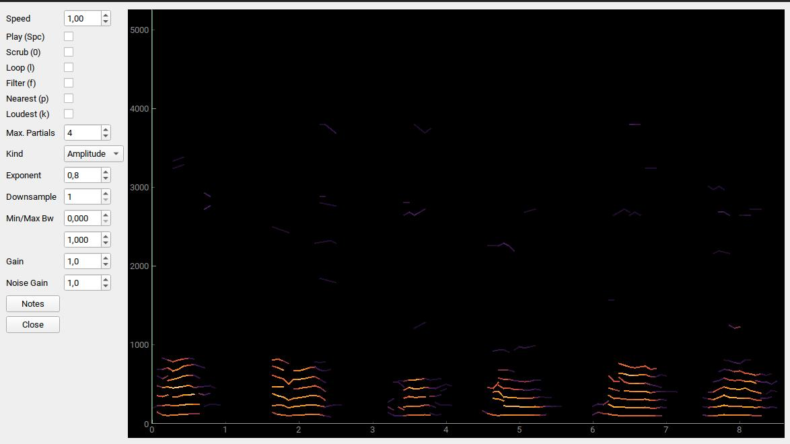
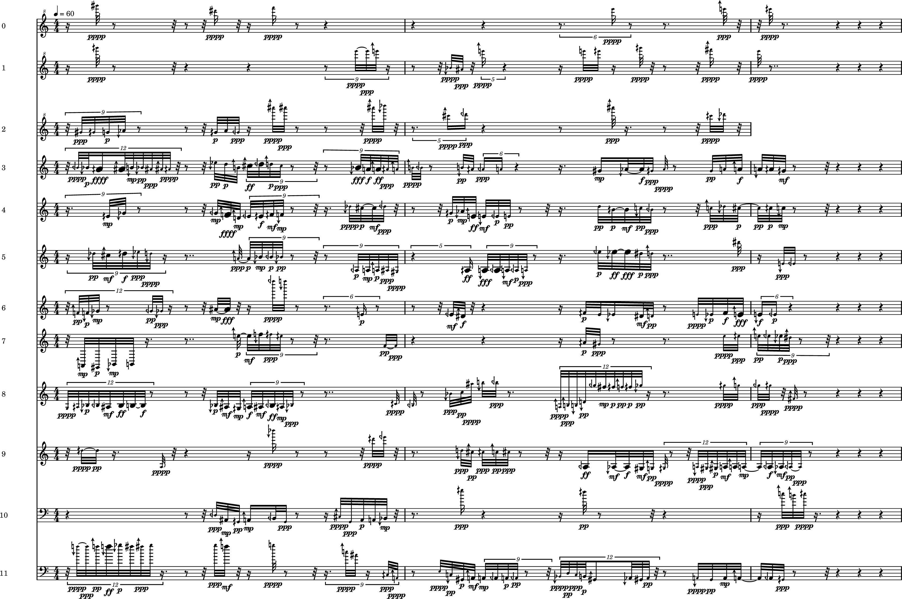

# sndscribe

**sndscribe** translates a spectrum of a soundfile into musical notation.

A spectrum is the result of partial tracking analysis, done via
[sndtrck](https://github.com/gesellkammer/sndtrck)

This is done in a series of steps:

* spectral analysis, using `sndtrck`
* translation of partial tracking information to musicxml, with the
  possibility of using microtones and dynamics
* generate lilypond and pdf files
* pitch resolution up to 1/8 tones
* transient and formant analysis can be used to further annotate the transcription
* listen to the transcription

# Dependencies

* csound >= 6.13 (for playback)
* csound-plugins: https://github.com/csound-plugins/csound-plugins

# installation

1) Install csound and lilypond
2) Install sndscribe

`pip install sndscribe`

That should install all the python dependencies needed

**NB**: only python >= 3.7 supported
  
## Example

#### Original Soundfile

[colours](examples/colours-slower-mono.mp3)

#### Partial Tracking

#### Transcription

Sound of transcription: [transcription](examples/colours-slower-mono-transcr.mp3)
